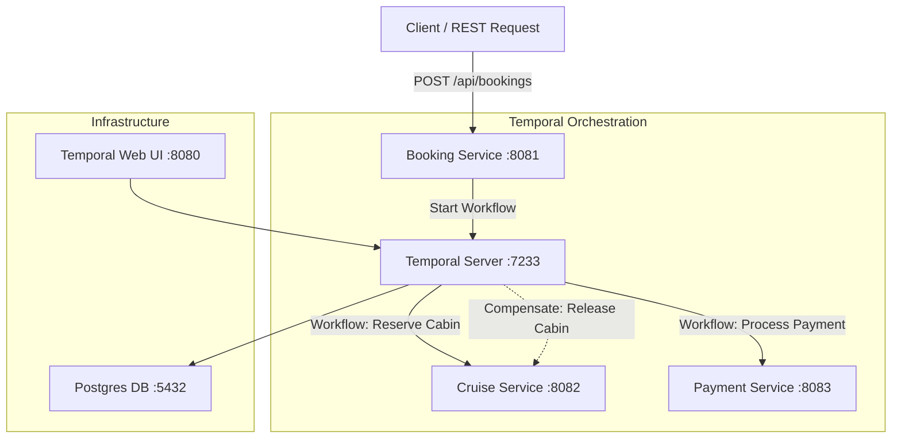

# Voyage Mart: Cruise Booking Microservices

A modern Java Spring Boot microservices platform built using **Bazel** and orchestrated via **Temporal Workflows**. This system executes distributed transactions across multiple services using the **Saga Pattern** for rollback/compensation when steps fail.

---

## 🏗️ System Architecture

The project consists of three spring-boot services that coordinate using Temporal workflows. In production, they are packaged into a single multi-container Pod structure (running on GCP GKE) so they can share local endpoints and coordinate efficiently.



### Microservices
1.  **Booking Service (Port `8081`)**: The entry point exposing the public REST API (`POST /api/bookings`). It launches the Temporal client and hosts the Orchestrator Workflow (`CruiseBookingWorkflow`).
2.  **Cruise Service (Port `8082`)**: Cabin reservation worker. Mock inventory is preloaded with `cabin_101`, `cabin_102`, and `cabin_103`.
3.  **Payment Service (Port `8083`)**: Payment processor worker. If payment fails (e.g. invalid amount), it throws an exception triggering the Saga rollback workflow.
4.  **Shared Library (`shared/`)**: Contains shared models, DTOs, interfaces, and shared queue definitions.

---

## 🛠️ Prerequisites

Make sure you have the following installed on your machine:
*   [Docker](https://www.docker.com/) & Docker Compose
*   [Bazel](https://bazel.build/) (v6.x or newer recommended)

---

## 🚀 Running the Project Locally

A helper script is provided to compile targets with Bazel, copy the built JAR artifacts into their respective service directories, and spin up the Docker containers.

Run the following command in the root folder:
```bash
./build_and_run.sh
```

### Under the Hood: Individual Bazel Build Commands
If you want to manually build individual modules using Bazel:
```bash
# Build the shared model & interfaces library
bazel build //shared:shared

# Build the Booking Service Boot JAR
bazel build //booking-service:booking-service

# Build the Cruise Service Boot JAR
bazel build //cruise-service:cruise-service

# Build the Payment Service Boot JAR
bazel build //payment-service:payment-service

# Build all targets in the workspace
bazel build //...
```
The compiled fat JARs will be output to `bazel-bin/<service-name>/<service-name>.jar`.

---

## 🧪 Verification & Manual Testing

Once the containers are running and healthy (you can check with `docker ps`), you can test the success and rollback flows using `curl`.

### 1. Test Case A: Successful Booking
Book `cabin_103` with a valid payment amount:
```bash
curl -X POST http://localhost:8081/api/bookings \
  -H "Content-Type: application/json" \
  -d '{"customerId":"cust_123", "cruiseId":"cruise_caribbean", "cabinId":"cabin_103", "amount":500.0}'
```

**Expected Response**:
```json
{
  "bookingId": "6ac23694-8af4-4f5c-a6cb-5ca5d073c1e2",
  "status": "CONFIRMED",
  "message": "Booking confirmed. Txn ID: txn_1c818fb8"
}
```

---

### 2. Test Case B: Failed Payment & Saga Compensation (Rollback)
Book `cabin_102` with a negative amount (`-10.0`). The Payment Service will throw an error, prompting the workflow to catch the exception and trigger the Saga compensation (releasing the cabin hold):
```bash
curl -X POST http://localhost:8081/api/bookings \
  -H "Content-Type: application/json" \
  -d '{"customerId":"cust_123", "cruiseId":"cruise_caribbean", "cabinId":"cabin_102", "amount":-10.0}'
```

**Expected Response**:
```json
{
  "bookingId": "3ae90f37-871f-45ca-91fb-ece8b5913251",
  "status": "FAILED",
  "message": "Booking failed: Payment processing failed: amount must be greater than zero"
}
```

#### Re-verify Cabin Rollback
Because the Saga compensation was triggered, `cabin_102` was successfully released. You can prove this by booking `cabin_102` again with a positive payment amount:
```bash
curl -X POST http://localhost:8081/api/bookings \
  -H "Content-Type: application/json" \
  -d '{"customerId":"cust_123", "cruiseId":"cruise_caribbean", "cabinId":"cabin_102", "amount":500.0}'
```

**Expected Response**:
```json
{
  "bookingId": "56bbffc8-1675-4c5c-a2bf-b8e32e142bcd",
  "status": "CONFIRMED",
  "message": "Booking confirmed. Txn ID: txn_8a37367a"
}
```

---

### 3. Monitoring via Temporal Web UI
To visualize the workflow steps, retries, inputs, outputs, and compensation paths, visit the Temporal Web console in your browser:
👉 **[http://localhost:8080](http://localhost:8080)**

---

## ☁️ GCP Deployment (GKE Single Pod)

For deployment on Google Kubernetes Engine (GKE), the services run in a single **multi-container Pod** structure to share network resources.

1.  **Build and push the Docker images** to your GCP Container/Artifact Registry:
    ```bash
    # 1. Compile targets
    bazel build //...
    cp bazel-bin/booking-service/booking-service.jar booking-service/
    cp bazel-bin/cruise-service/cruise-service.jar cruise-service/
    cp bazel-bin/payment-service/payment-service.jar payment-service/

    # 2. Tag and push (replace your GCP project ID)
    docker build -t gcr.io/[PROJECT_ID]/booking-service:latest ./booking-service
    docker build -t gcr.io/[PROJECT_ID]/cruise-service:latest ./cruise-service
    docker build -t gcr.io/[PROJECT_ID]/payment-service:latest ./payment-service

    docker push gcr.io/[PROJECT_ID]/booking-service:latest
    docker push gcr.io/[PROJECT_ID]/cruise-service:latest
    docker push gcr.io/[PROJECT_ID]/payment-service:latest
    ```

2.  **Configure Manifests**:
    Open [k8s/voyage-journey-deployment.yaml](file:///Users/nishi/Documents/GitHub/voyage-mart/k8s/voyage-journey-deployment.yaml) and replace `gcr.io/your-gcp-project/` with your actual GCP Project path.

3.  **Apply manifests to the cluster**:
    ```bash
    kubectl apply -f k8s/voyage-journey-deployment.yaml
    ```
    This launches all three services inside a single Pod sharing the same `localhost` context and exposes the Booking Service REST endpoint via a LoadBalancer on port 80.
